# Recipe 1: Github, VSTS and Kubernetes

CI/CD pipeline between Github, Microsoft's Visual Studio for Teams \(VSTS\) and Kubernetes.

## Audience

The target audience for this tutorial is anyone looking for a Continuous Integration/Continous Delivery pipeline solution using Github, VSTS and Kubernetes as the deployment platform. This  
is a step-by-step approach with many details on how things get connected together.

## Prerequisites

For this pipeline, you will need:

* A Github account
* An Azure account
* A Visual Studio for Teams \(VSTS\) account at visualstudio.com

## Solution Details

This guide will walk you through the process of creating a Continuous Integration/Continous Delivery pipeline \(CI/CD pipeline\).

## Table of Contents

### Understanding the components of our infrastructure

| Components | Role | Notes |
| --- | --- | --- |
| Github | Source code Version Control System | Our Dockerfile and the Kubernetes services and deployment file will also be hosted here. |
| VSTS | - Build docker images, Push docker images to the repo and deploy to Kubernetes | Azure Container Registry will the the repository for the images. You could also change this here and use dockerhub. Kubernetes will run on Azure Container Services \(AKS\) |

Our flow will be:

1. Code is pushed to Github
2. A Webhook is sent from Github to VSTS.
3. Based on the reception of the Webhook, VSTS will fetch the `Dockerfile` from the repository on Github and run a build image action.
4. A new Docker image of our code will be pushed to our Azure Container Registry repository.
5. VSTS will deploy the our workload based on the instruction from the `azure_visualizer-deployment.yml` file found under our repository.
6. Finaly, VSTS will will deploy a services object following the `azure_visualizer-svc.yml` file.

## Creating the Continuous Integration

In the first part of this tutorial, we will create the mechanism for the Continous Integration. Essentially, our code will live on Github and whenever there's a change to this code \(e.g.: a developer commits changes to the repo\) we will setup a Webhook that will trigger an action, informing VSTS of these changes. Once informed by Github, VSTS will act based on the rules we will setup soon.

## Create an Azure Container Repository

### Create a container repository on Azure

Create a resource group

```bash
az group create --location westus2 --name myCICDpipeline
```

then proceed by creating your new container repository

```bash
az acr create --name CICDpipeline --resource-group myCICDpipeline --sku Basic
```

## Configuring Github

For this example, fork the code available at: [https://github.com/dcasati/azure\_visualizer.git](https://github.com/dcasati/azure_visualizer.git)

With this new fork, let's go ahead the enable a Webhook

### Step 1 - Setting up a Webhook

## Configuring VSTS

### Create a new Project

### Setup the Continous Integration on VSTS

Step 1: Click on the Build button then on **+New definition**

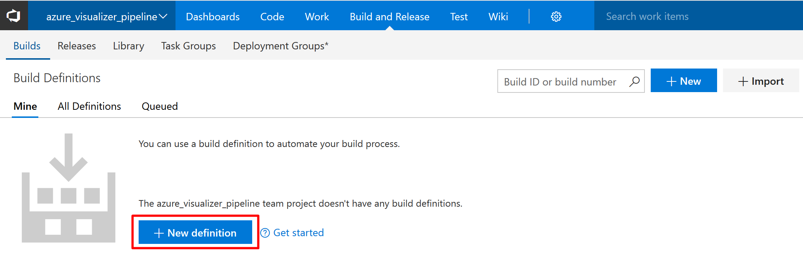

Step 2: Next, on the `Select a template` screen, choose **start with an Empty process**.

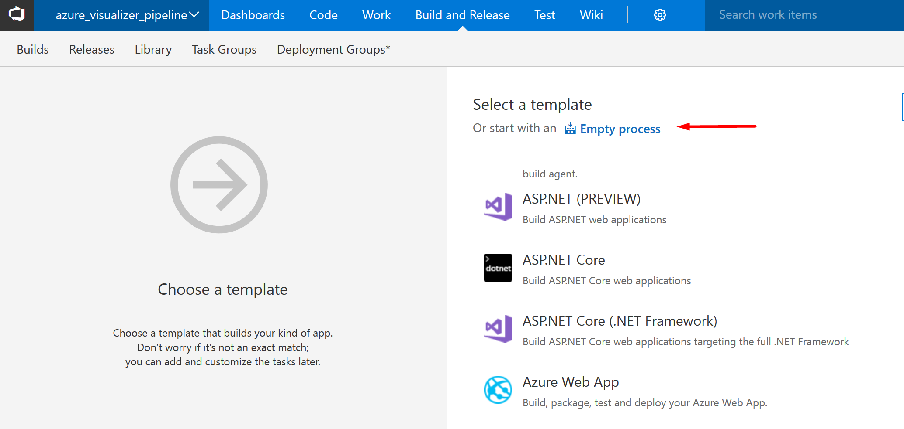

Step 3: Click on `Get sources` then select **Github** from the sources available on the right side.

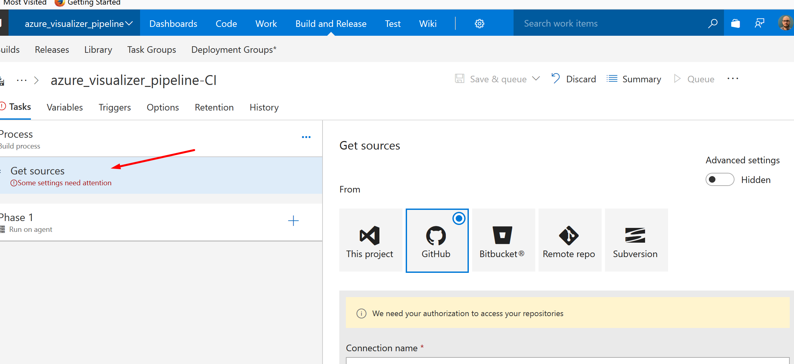

Step 4: Authorize the Github connection, then select the repository where you've forked the `azure_visualizer` code and the branch that will be used. Finally, under the `Clean` option, select **false**.

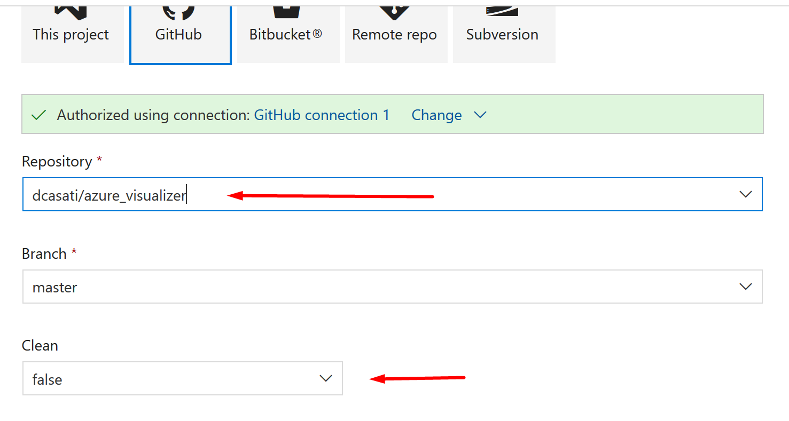

Step 5: Click on the `Save and queue` icon and then select `Save`. Next, on the left side of the screen, click on `Process`. Name the Process with something meaningful such as `azure_visualizer_pipeline-CI`. Under the `Agent queue`, select **Hosted Linux Preview**.

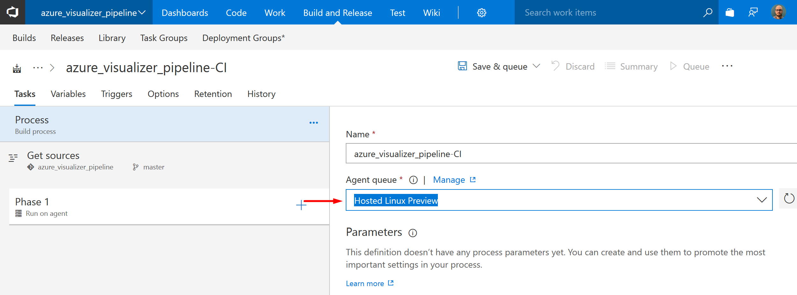

Step 6: With the initial connection to Github in place we will now configure the components that will build and publish the Docker image.

Step 7: Add a task to the phase by clicking on the plus sign.

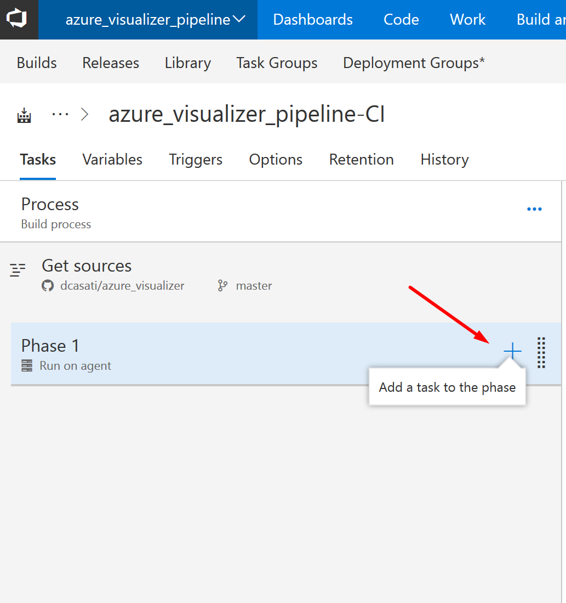

Step 8: On the `Add tasks blade` search for `docker` then click on `Add`. While here, go ahead and click on `Add` one more time. We will use the Docker integration when building and then when pushing the image to the repository.


Step 9: Name the first docker task as `Build an image`. Select **Azure Container Registry** as the `Container Registry Type` and then select an appropriate Azure subscription.

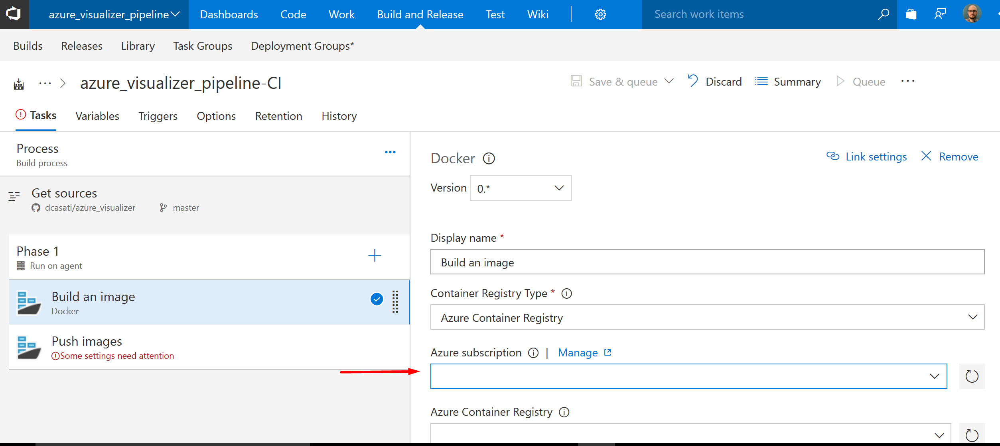

In my case, you can see that the registry `casatix` was choosen and that the `Docker File` was set to `/**Dockerfile`. Click on `Save and queue` then on `Save`. Select **Build image** under the `Action` section.

> Note: `/**Dockerfile` should correspond to the Dockerfile on your Github repo. If you have forked our code example, than you are good to go. If you are adapting this tutorial to your use caase, make sure that you map this option correctly otherwise you will not be able to build an image.

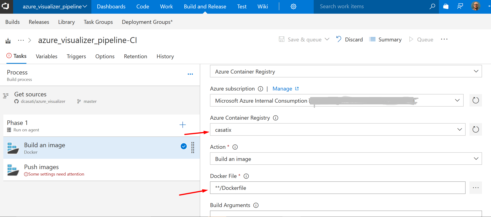

Step 10: Click on the second Docker task and name that `Push images`. Like the previous step, choose the appropriate `Container Registry Type`, `Azure subscription` and the `Azure Container Registry`.

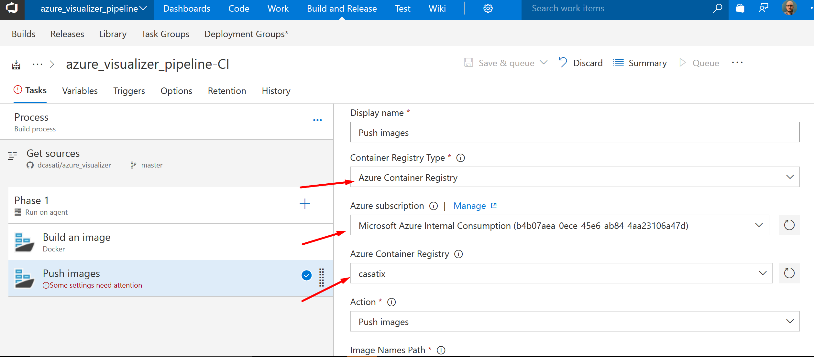

Finaly, select **Push images** under the `Action` section.

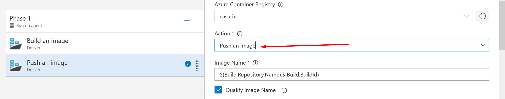

Select `Include Latest Tag`

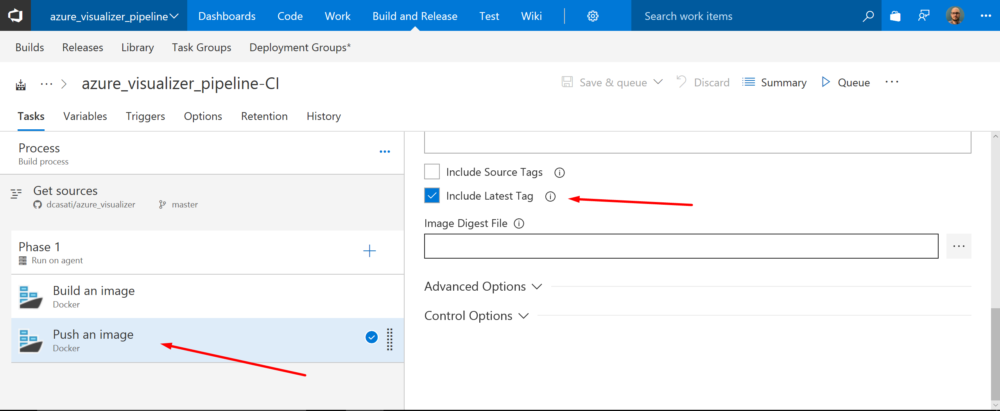

Click on `Save and queue` then on `Save`.

### Setup the Continous Delivery on VSTS

Name this as `Phase 2 - Continous Delivery`

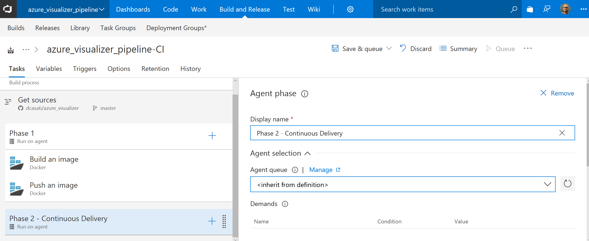

Click on the plus sign in front of the `Phase 2` and select to add a new task. Filter the task for `kubernetes` then click on `Add`. Do this step one more time as we will need two Kubernetes tasks, one for the deployment and another for the sevice.

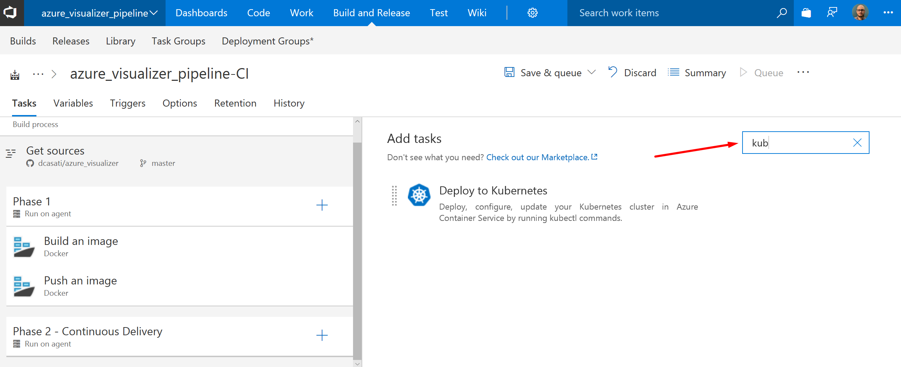

Name this first task `Create Kubernetes Deployment`,

| Item | Value |
| --- | --- |
| Display name | Create Kubernetes Deployment |
| Kubernetes Service Connection | Paste your KUBECONFIG here\* |
| Container Registry type | Azure Container Registry |

### Getting the KUBECONFIG from AKS

You will need to retrieve your KUBECONFIG for the `Kubernetes Services Connection`. To get this file, execute the following:

```bash
az aks get-credentials -g myResourceGroup -n myCluster -f myk8s_cluster.conf
```

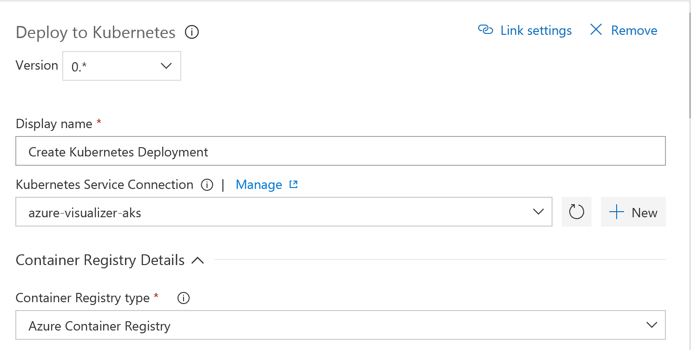

Scroll down the `Commands` section and select **create** under `Command` dropdown menu. Select the `Use Configuration files` option. Then under the  `Configuration File` click on the button button to select the deployment file \(`azure_visualizer-deployment.yml` in the picture\).

> Note: This file is hosted on your Github repository.

Click on `Save and Queue` then on `Save`.

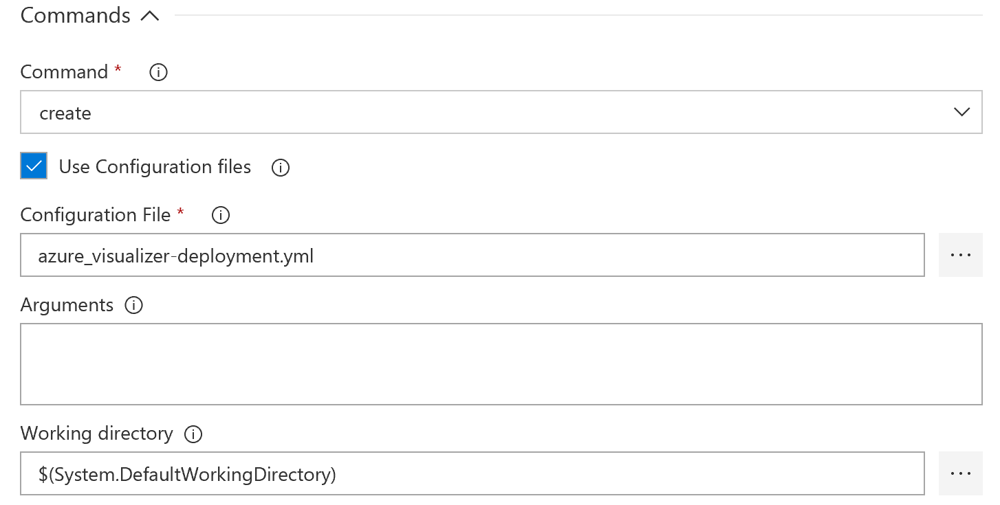

Repeat the previous step for the the next Kubernetes task with the following values:

| Item | Value |
| --- | --- |
| Display name | Create Kubernetes Service |
| Kubernetes Service Connection |  |
| Container Registry type | Azure Container Registry |
| Azure Container Registry | casatix\* |

> \* Modify this value to reflect your setup.

Commands

| Item | Value |  
| --- | --- |  
| Command | create |  
| Configuration File | azure_visualizer-svc.yml |

Click on `Save and Queue` then on `Save`.

## Checking the deployment

You can verify if the deployment was successful by running the following:

```bash
$ kubectl get pods -l k8s-app=azure-visualizer
NAME                                READY     STATUS    RESTARTS   AGE
azure-visualizer-1640327816-t8f3g   1/1       Running   0          10d
```


